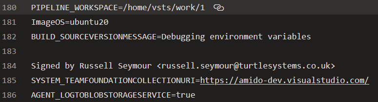

EnvFile is a very simple application that will creates a Docker compatible environment file.

It has been developed to be used in conjunction with the Amido Independent Runner.

There are several reasons for developing the utility. The first one is that across Linux, Windows and MacOS there is not one set of tools that can be relied upon to exist to correctly create the environment file. As this is a Go application it can be compiled for all platforms and produce the same results on each platform.

The second reason is that some environment variables may contain newlines. Before, when we were using the `env > envfile` command to generate the file, these would be faithfully added to the envfile. However Docker does not like multi line variables and will throw an error when a container is initialised. Initially the fix was to grep out the offending variables, e.g. `env | grep -v SOURCEVERSIONMESSAGE` but that removed the first line of the variable, including the name, and left the rest behind.

The following images show the before and after when running the `env | grep -V SOURCEVERSIONMESSAGE` command

| Before | After |
|---|---|
|  |  |

The utility will replace all new lines with a space, by default, so that the variable values are all on one line.

## Usage

The command has three arguments, as described below:

| Argument | Default | Description |
|---|---|---|
| `-p` | envfile | The path to the resultant envfile that is created |
| `-e` | | Comma delimited list of variables that should be excluded from the output |
| `-r` | " " | The character to replace newlines with |
| `-h` | | Display help |

